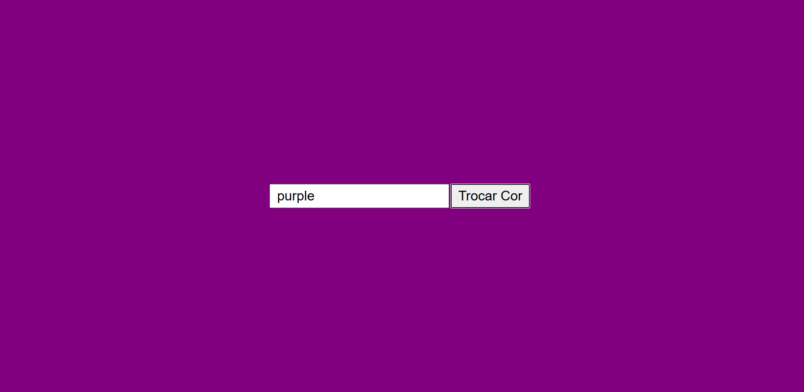

 # Trocar cor da página

 

 ---
 ## Sobre
 Projeto do curso de desenvolvimento de sistemas do SENAI Jandira com o objetivo de trocar a cor do body com javascrip.

 ---
 ## Tencologias utilizadas
 - HTML
 - CSS
 - JS

 ---
 ## Autor

 - [Fernando Leonid](https://github.com/fernandoleonid/)